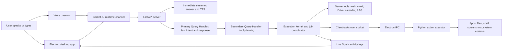

# Spark AI Hackathon Pitch

## Product Name

Spark AI

## Tagline

An AI assistant that does not just answer you. It works with your apps, files, voice, browser, and connected services to finish real tasks.

## One-Liner

Spark AI is a local-first desktop assistant that turns natural language into real actions across your computer and cloud tools, with fast voice feedback, tool execution, memory, and user approval for sensitive actions.

## 30-Second Opening

Most AI assistants are trapped inside a chat box. They can explain what to do, but they cannot reliably do the work across your actual desktop, files, browser, email, calendar, and apps.

Spark AI exists to fix that gap. It is a desktop-native AI workspace where you can speak or type a request like "summarize my unread emails, draft a reply, and organize my Downloads folder," and Spark can understand the intent, respond immediately, plan the task, request permission when needed, and execute the right tools across your machine and connected services.

Our goal is simple: make AI feel less like a website you visit and more like an operating layer for everyday work.

## The Problem

People do not need another chatbot that gives instructions. They need help completing the messy work that happens across many places:

- Desktop apps, files, folders, browser tabs, email, calendar, Slack, Drive, and notes.
- Voice interactions that feel instant, not slow and awkward.
- Personal context and memory without sending everything into one opaque cloud workflow.
- Safety controls before an assistant sends messages, edits files, runs shell commands, or touches private accounts.

Today, users switch between tools, copy-paste context, ask AI for advice, then manually perform the work. That breaks the promise of AI productivity.

## Why Spark Exists

Spark exists because the next useful AI assistant needs three things at once:

- It must understand the user's intent.
- It must have access to the tools where work actually happens.
- It must respect user control, privacy, and approvals.

Spark is built as a desktop companion instead of a browser-only chatbot. That gives it the ability to work with local files, apps, device state, microphone input, and secure system-level actions while still connecting to cloud services when the user allows it.

## What Spark Is

Spark is a realtime desktop AI assistant with four major pieces:

- Electron desktop app: the user interface for chat, voice, activity logs, permissions, connectors, tools, history, automation, and settings.
- FastAPI server: the intelligence and orchestration layer. It handles auth, sockets, chat, streaming responses, tools, memory, connectors, and execution state.
- Voice daemon: an always-on mic worker that listens for wake phrases like "hey spark", streams speech to the server, and plays TTS responses.
- Tool and connector system: the execution layer for web research, files, apps, shell, email, calendar, Drive, Slack, Notion, GitHub, browser actions, screenshots, weather, and more.

## How The Flow Works

## What Makes The Architecture Strong

Spark uses a split-brain design on purpose:

- PQH, the Primary Query Handler, responds quickly so the user gets immediate feedback.
- SQH, the Secondary Query Handler, handles task planning and tool execution in the background.
- The streaming path and tool-execution path run in parallel, so the assistant can speak while work is being planned.
- The voice path performs speculative prefetch while the user is still speaking, loading recent context and RAG data before the final transcript is complete.
- The execution kernel tracks jobs, dependencies, logs, approvals, results, retries, and tool output.
- Sensitive tasks can trigger approval modals before Spark sends an email, uploads a file, edits cloud data, or runs a command.

## Core Features To Pitch

- Natural voice and text chat.
- Realtime Socket.IO interaction between desktop and server.
- Wake-word voice daemon with VAD and streaming speech chunks.
- Fast spoken responses with TTS streaming and interruption.
- Tool execution across local desktop and server-side services.
- Live activity timeline showing what Spark is doing.
- Approval flow for high-impact actions.
- Connectors for Gmail, Google Calendar, Google Drive, Slack, Notion, and GitHub.
- Capabilities dashboard for available tools.
- Permissions page for shell and command access.
- Memory and RAG for personalized context.
- Plugin-based tools so Spark can grow beyond the hackathon demo.

## Demo Story

### Demo 1: Everyday Productivity

Prompt:

> Spark, summarize my unread emails and draft a short reply to the most important one.

What to show:

- Spark understands the request.
- It checks connected Gmail.
- It summarizes results.
- It asks for approval before sending or drafting anything sensitive.
- The activity log shows the tool steps.

### Demo 2: Desktop Action

Prompt:

> Organize my Downloads folder and tell me what changed.

What to show:

- Spark plans a local file operation.
- The client-side executor handles desktop file actions.
- The UI shows progress and final result.
- The user remains in control.

### Demo 3: Realtime Voice

Prompt:

> Hey Spark, what is my battery level and what is the weather right now?

What to show:

- Wake phrase activates the daemon.
- Speech streams to the server.
- Spark answers naturally with TTS.
- It can call system and web/location tools in one flow.

## Why This Is Different

Most AI assistants sit in one of two categories:

- Chatbots that understand language but cannot act deeply.
- Automation tools that act but require rigid setup and manual workflows.

Spark combines both:

- Natural language interface.
- Desktop-native execution.
- Cloud connectors.
- Local memory and context.
- Realtime voice.
- Human approval for risky actions.

That combination makes Spark feel closer to a personal operator than a chatbot.

## Target Users

Spark is useful for:

- Students and builders who juggle notes, code, files, research, and communication.
- Professionals who live across email, calendar, Slack, documents, and browser tabs.
- Creators who need research, drafting, screenshots, file organization, and publishing help.
- Power users who want AI to control their workflow without giving up oversight.

## The Real-World Impact

Spark reduces the gap between intention and execution. Instead of:

1. Asking AI what to do.
2. Copying the answer.
3. Opening apps manually.
4. Repeating context.
5. Doing the task yourself.

The user can simply express the goal and let Spark coordinate the work.

That saves time, lowers cognitive load, and makes advanced automation accessible to non-technical users.

## Technical Highlights For Judges

- Electron + React + TypeScript desktop app.
- FastAPI backend with HTTP APIs and Socket.IO realtime sessions.
- JWT-authenticated user sockets and daemon-token auth for the voice worker.
- Streaming LLM responses plus parallel task orchestration.
- PQH/SQH architecture for low-latency response and deeper execution.
- Execution kernel with job coordination, task dependencies, logs, approvals, and tool outputs.
- Client/server tool split for local OS actions and backend/cloud actions.
- Voice daemon with openWakeWord, Silero VAD, streaming STT, and TTS playback.
- Connector registry for OAuth and MCP-based external services.
- Plugin-ready tool architecture for future expansion.

## Suggested 2-Minute Pitch Script

Hi, I am building Spark AI.

The problem I am solving is that most AI assistants still stop at advice. They can tell you how to do something, but the real work happens across your computer: your files, apps, browser, inbox, calendar, messages, and cloud services. So users still have to copy-paste context, switch apps, and manually execute the steps.

Spark is a desktop-native AI assistant that closes that gap. You can speak or type a goal, and Spark can respond instantly, plan the task, call the right tools, ask for approval when the action is sensitive, and then execute across local and cloud tools.

Under the hood, Spark has an Electron desktop interface, a FastAPI orchestration server, a voice daemon for wake-word and speech streaming, and a tool kernel that can route work to server tools or local desktop actions. The key architecture is split into two layers: one layer answers quickly so the assistant feels alive, and the second layer handles planning and execution in the background.

For the demo, I can ask Spark to summarize unread emails, organize a local folder, search the web, check weather, open apps, or manage connected services. The user sees every step in the activity log and approves risky actions before they happen.

Spark is not just another chatbot. It is an operating layer for getting work done.

## Closing Line

The future of AI assistants is not just better answers. It is trusted action. Spark brings that future to the desktop.

