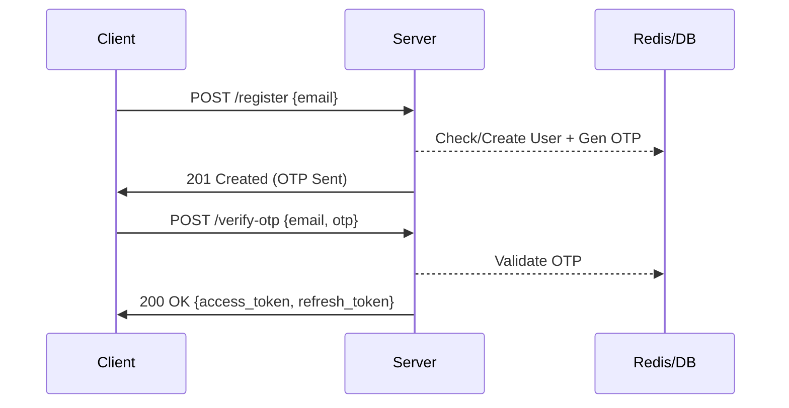
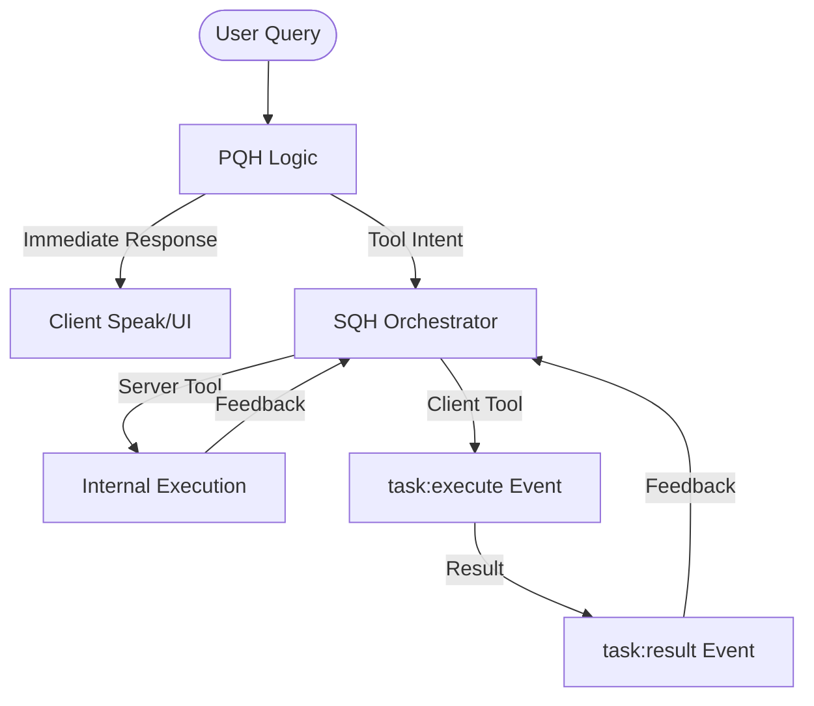

# 🤖 AI Assistant Server & Orchestration Engine

Welcome to the heart of the AI Assistant. This server is a production-grade backend designed to handle high-concurrency voice and text interactions, manage complex multi-step tasks, and orchestrate execution between the cloud and edge clients.

---

## 🧭 Interface & Navigation
| Area | Link |
| :--- | :--- |
| **Quick Start** | [🚀 Setup & Run](#-quick-start) |
| **Security** | [🔐 Auth & Token Strategy](#-authentication--security) |
| **Comms** | [🔌 WebSocket Protocol](#-communication-websockets) |
| **Logic** | [🧠 Dual-Layer Intelligence (PQH/SQH)](#-dual-layer-intelligence-pqh--sqh) |
| **Edge** | [💻 Client-Core Integration](#-client-integration-client_core) |
| **Capabilities** | [🛠 Tool Registry](#-tool-registry) |

---

## 🚀 Quick Start

The server is built with **FastAPI** for HTTP/Auth and **Socket.connect** for stateful AI sessions.

1.  **Environment Setup**:
    ```bash
    cp env.sample .env
    # Update OPENROUTER_API_KEY, REDIS_URL, MONGO_URI
    ```
2.  **Infrastructure**:
    -   **Redis**: Used for session caching, message history, and user context.
    -   **MongoDB**: Persistent storage for users and chat logs.
3.  **Deployment**:
    ```bash
    docker-compose up --build
    ```

---

## 🔐 Authentication & Security

The server implements a **stateless authentication architecture** with stateful session management in Redis.

### 1. Passwordless Registration/Login
User authentication is email-based with OTP verification.



### 2. Auto-Refresh Strategy
Clients should maintain an `Axios` or `Fetch` interceptor to handle `401 Unauthorized`.

> [!IMPORTANT]
> **Token Rotation**: Every refresh request returns a **new** refresh token. The old one is invalidated to prevent replay attacks.

```javascript
// Pseudo-code for Token Refresh
const refreshTokens = async () => {
    const res = await api.post('/auth/refresh-token', { refresh_token: storedRefresh });
    if (res.status === 200) {
        saveTokens(res.data.access_token, res.data.refresh_token);
        return true;
    }
    return false; // Force re-login
};
```

---

## 🔌 Communication (WebSockets)

All real-time interaction (Text, Voice, Tooling) happens over a secure Socket.IO connection.

### Connection Handshake
You must pass the JWT in the `auth` header during the initial handshake.

```javascript
import { io } from "socket.io-client";

const socket = io("wss://api.yourserver.com", {
  auth: { token: localStorage.getItem("access_token") },
  transports: ["websocket"] // Optimized for lower latency
});
```

### Key Events Matrix
| Event | Type | Data Schema |
| :--- | :--- | :--- |
| `send-user-text-query` | Emit | `{ query: string }` |
| `send-user-voice-query`| Emit | `{ audio: base64, mimeType: string }` |
| `query-result` | Listen | `PQHResponse` (See below) |
| `task:execute` | Listen | `TaskRecord` (Single task) |
| `task:batch` | Listen | `List[TaskRecord]` (Parallel/Chained tasks) |
| `task:result` | Emit | `{ task_id: string, result: TaskOutput }` |

---

## 🧠 Dual-Layer Intelligence (PQH & SQH)

The "Secret Sauce" of this server is the split between user-facing responsiveness and background task execution.

### 1. PQH (Primary Query Handler)
The PQH is the AI's "Pre-frontal Cortex." 
- **Latency**: < 800ms.
- **Goal**: Talk back to the user immediately.
- **Behavior**: It does NOT execute tools. It **plans** them and returns a thought process and voice response.

### 2. SQH (Server/Semantic Query Handler)
The SQH is the "Subconscious Brain."
- **Trigger**: Automatically fired when PQH output contains `requested_tool`.
- **Binding**: SQH takes the `requested_tool` plan, resolves dependencies, and pushes specific `task:execute` instructions to the client or executes them internally.



---

## 💻 Client Integration (`client_core`)

For native apps (Python/Electron) that need to handle filesystem, apps, or system control, use the **Client-Core** module.

### Directory Structure
Developers should copy the `app/client_core` directory into their native project.
- `/engine`: Handles task scheduling and dependency resolution.
- `/executor`: Maps server-sent tool names to local Python functions.
- `/tools`: Implementation of local tools (file, system, etc.).

### Integration Steps
```python
# 1. Initialize the Core
from client_core import initialize_client, receive_tasks_from_server
initialize_client(user_id="xyz")

# 2. Wire into Socket.IO
@sio.on("task:execute")
async def handle_task(data):
    # This automatically resolves dependencies and runs the tool
    await receive_tasks_from_server(user_id, data)

@sio.on("task:batch")
async def handle_batch(data):
    await receive_tasks_from_server(user_id, data)
```

### The `TaskRecord` Schema
When building custom executors, understand the `TaskRecord` payload:
```json
{
  "task": {
    "task_id": "uuid_123",
    "tool": "file_create",
    "inputs": { "path": "/tmp/test.txt", "content": "hello" },
    "depends_on": ["previous_task_id"]
  },
  "status": "pending"
}
```

---

## 🛠 Tool Registry

The following tools are partitioned between server and client execution.

| Tool Name | Namespace | Target | Inputs |
| :--- | :--- | :--- | :--- |
| `web_search` | `core.web` | Server | `query` (str) |
| `open_app` | `host.sys` | Client | `target` (str) |
| `file_read` | `host.fs` | Client | `path` (str) |
| `executor_shell`| `host.sh` | Client | `command` (str) |

---

© 2026 SiddTheCoder. Built for the future of AI agent orchestration.
